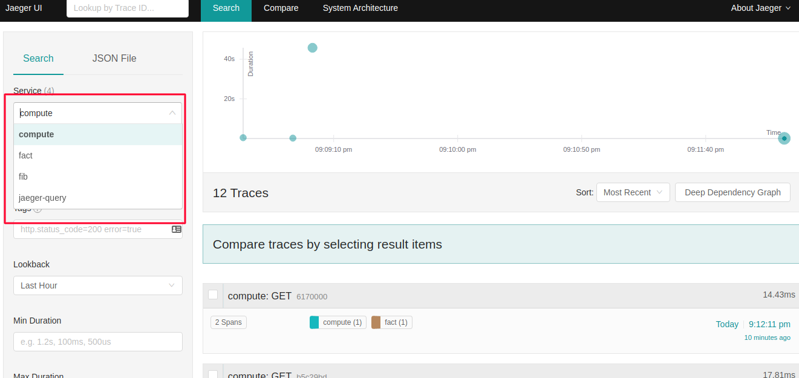
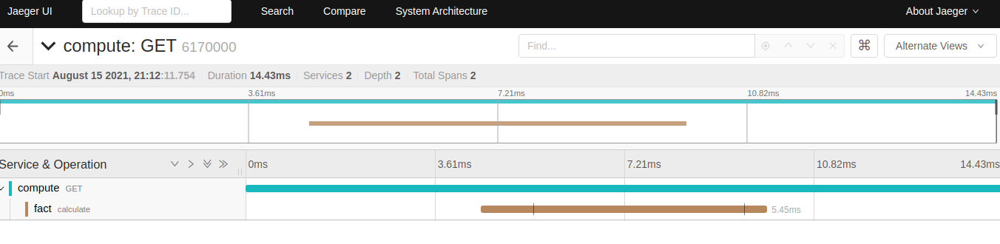

#### Трассировка с jaeger

[Distributed Tracing In Microservices – Jaeger With Spring Boot](https://www.vinsguru.com/distributed-tracing-in-microservices-with-jaeger/)

Компиляция
````shell script
mvn clean package
````

Запуск

````shell script
docker-compose up
````

Тесты

````shell script
http://localhost:8080/api/compute/fact/10

http://localhost:8080/api/compute/fib/10

http://localhost:8080/api/compute/fib/50
````

Jaeger UI

[http://localhost:8090](http://localhost:8090)



